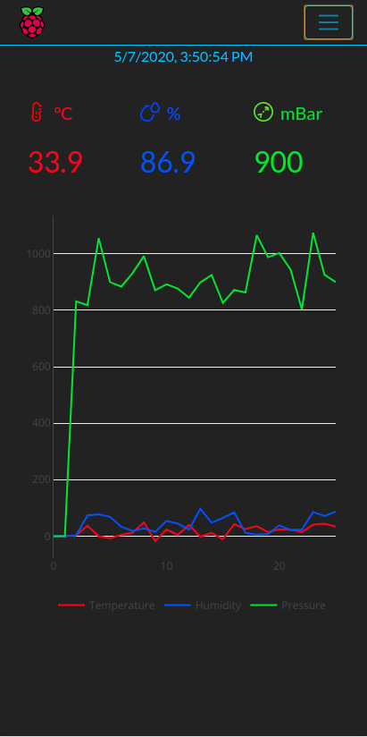
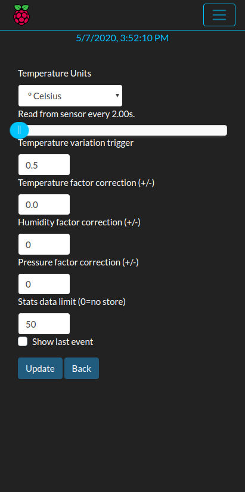
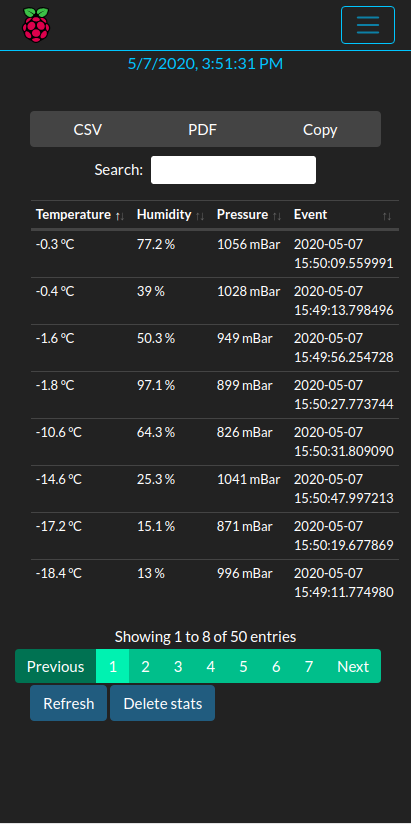
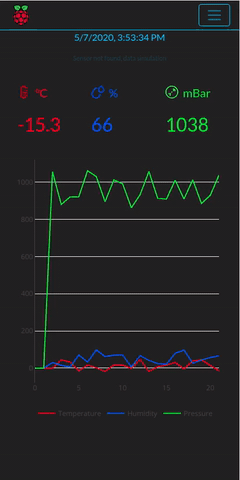

# THPHat_pi
Simple flask webapp dashboard running on [Raspberry Pi](https://www.raspberrypi.org/) and [SenseHat](https://www.raspberrypi.org/products/sense-hat/) shield.



Shows temperature, humidity, barometric pressure and relative Plotly graph with autorefresh.

Get sensor values every "n" seconds (due to Settings section).



Values are sending (websocket) to client according to delta value from
previous one (minimum delta value to trigger is specified in Setting section).

A Stats section shows a table with all stored data (due to Settings section).





## Getting Started

### Prerequisites
SenseHat hardware connected to Raspberry Pi or, if not,  a "demo mode" starts automatically.

### Installing

From project root create virtual environment, activate it and install requirements:

```sh
~/THPHat_pi$ python3 -m venv venv
~/THPHat_pi$ source venv/bin/activate
~/THPHat_pi$ pip install -r requirements.txt
~/THPHat_pi$ python3 init-db.py
```

## Running

__as app__

```sh
export FLASK_APP=flaskr
flask run
```

__as wsgi server__

```sh
gunicorn --worker-class eventlet -w 1 -b localhost:8080 wsgi
```

## Deployment

As seen above, as any wsgi app.

## Authors 

Franco Parodi <franco.parodi@aol.com>

## License

This project is licensed under the MIT License.
